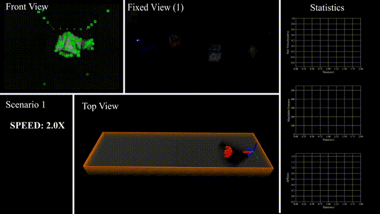
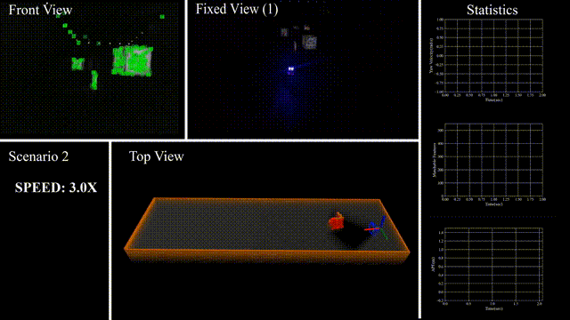
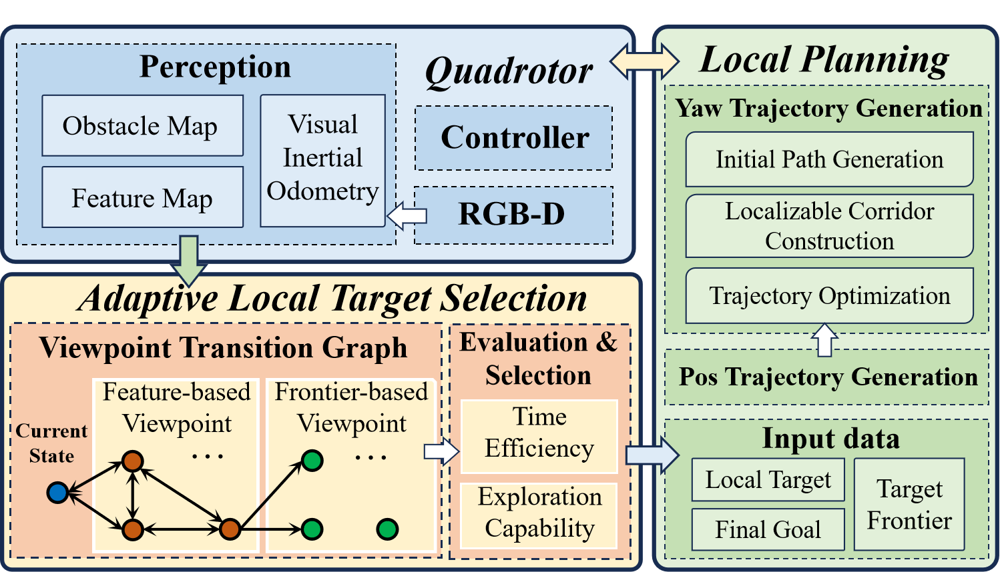
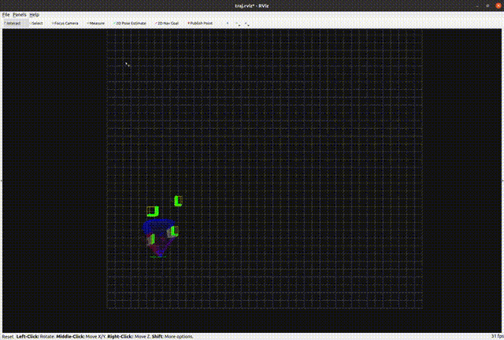
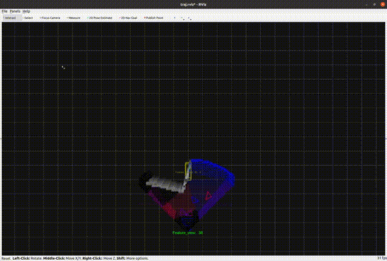
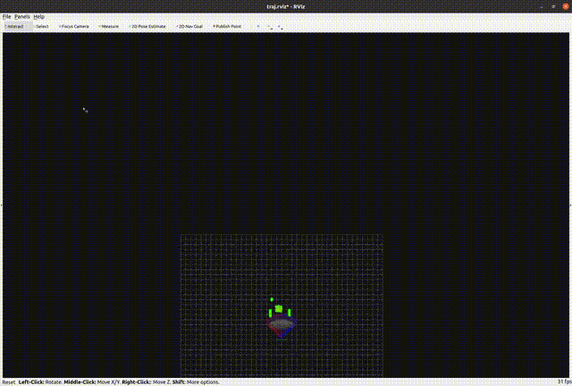
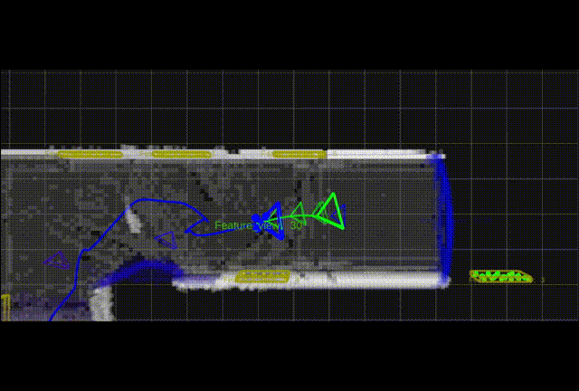

# LA-Planner

A novel **localization-aware** planner for quadrotor flight in **unknown** and **feature-limited** environments that properly allocates perception resources among environmental information during navigation. It tackles the issue of strong dependency on prior environmental knowledge inherent in traditional localization-aware planning methods.

<p align = "center">


</p>

## Introduction

**[IROS'25 oral]** This repository maintains the implementation of "**Perception-aware Planning for Quadrotor Flight in Unknown and Feature-limited Environments**". [arxiv Preprint](https://arxiv.org/abs/2503.15273)

**Authors**: [Chenxin Yu](https://robotics-star.com/people)\*, [Zihong Lu](https://robotics-star.com/people)\*,  [Jie Mei](https://scholar.google.com/citations?user=tyQm5IkAAAAJ&hl=zh-CN) and [Boyu Zhou](https://robotics-star.com/people)$^{\dagger}$.

**Institutions**: [STAR Group](https://robotics-star.com/), [HITSZ MAS Lab](https://hitsz-mas.github.io/mas-lab-website/)

**Video**: [Bilibili](https://www.bilibili.com/video/BV1bj99YgEeb).

The key modules of our method are illustrated in the following system overview.

<div align="center">
  
</div>
```
@article{yu2025perception,
  title={Perception-aware Planning for Quadrotor Flight in Unknown and Feature-limited Environments},
  author={Yu, Chenxin and Lu, Zihong and Mei, Jie and Zhou, Boyu},
  journal={arXiv preprint arXiv:2503.15273},
  year={2025}
}
```

Please kindly give us a star ⭐ if this project helps you.

## Setup

Our project has been tested on Ubuntu 20.04 with ROS installed.

### **Requirements**: 

- Ubuntu 20.04 LTS

- [ROS](http://wiki.ros.org/ROS/Installation) (tested with Noetic)

- [nlopt](https://github.com/stevengj/nlopt) v2.7.1

  ```
  git clone -b v2.7.1 https://github.com/stevengj/nlopt.git
  cd nlopt
  mkdir build
  cd build
  cmake ..
  make
  sudo make install
  ```

- Other dependencies installation

  ```
  sudo apt install libarmadillo-dev
  ```

### Compiling and Running

```
cd ${your catkin workspace}/src
git clone https://github.com/Robotics-STAR-Lab/LA-Planner.git
cd ..
catkin_make -DCMAKE_BUILD_TYPE=Release
```

We have prepared three maps of different sizes along with their corresponding `.launch` files. You can easily start the simulation (in map1) using the following command:

```
source devel/setup.bash
roslaunch exploration_manager run_map1.launch rviz:=true auto_trigger:=true
```

You should see the simulation in `rviz`. If everything works correctly, the quadrotor will automatically navigate to the predefined target. If you prefer to trigger manually, you’ll need to modify the input parameters `auto_trigger:=false` and wait until the quadrotor is stably hovering, then you can use the `2D Nav Goal` to send a trigger to start the navigation as shown below:

<p align="center">
  
</p>

Start the simulation in map2 using the following command:

```
source devel/setup.bash
roslaunch exploration_manager run_map2.launch rviz:=true auto_trigger:=true
```

<p align="center">
  
</p>

Start the simulation in map3 using the following command:

```
source devel/setup.bash
roslaunch exploration_manager run_map3.launch rviz:=true auto_trigger:=true
```

<p align="center">
  
</p>
**Note:** map3 is intentionally designed to be more challenging than map1 and map2. It consists of a long corridor including sharp turns, dead-ends, and staircases, which may lead to various navigation failures. The animation below shows one such failure case, where the quadrotor is considered to be unable to localize itself because the number of visible features remains below the threshold for a period of time.

<p align="center">
  
</p>

When any type of failure is triggered, the quadrotor will immediately terminate the navigation and forcibly hover. The terminal will continuously print the error code. You can refer to the source code or our paper to understand the meaning of each error type and the conditions that trigger them. We welcome contributions from everyone—whether it's improving our algorithm or proposing new methods to achieve better navigation performance.

## Acknowledgements

We use [MINCO](https://github.com/ZJU-FAST-Lab/GCOPTER) as our yaw trajectory representation.

We draw inspiration from the autonomous exploration framework in [FUEL](https://github.com/HKUST-Aerial-Robotics/FUEL).

Our perception-aware trajectory planning method is partially inspired by the design of [APACE](https://github.com/HKUST-Aerial-Robotics/APACE).

## License

The source code is released under the [GPLv3](https://www.gnu.org/licenses/) license.

## Maintenance

For any technical issues, please contact Chenxin Yu([studyxinchen@gmail.com](mailto:studyxinchen@gmail.com)) or Zihong Lu(luzong2001@gmail.com).
